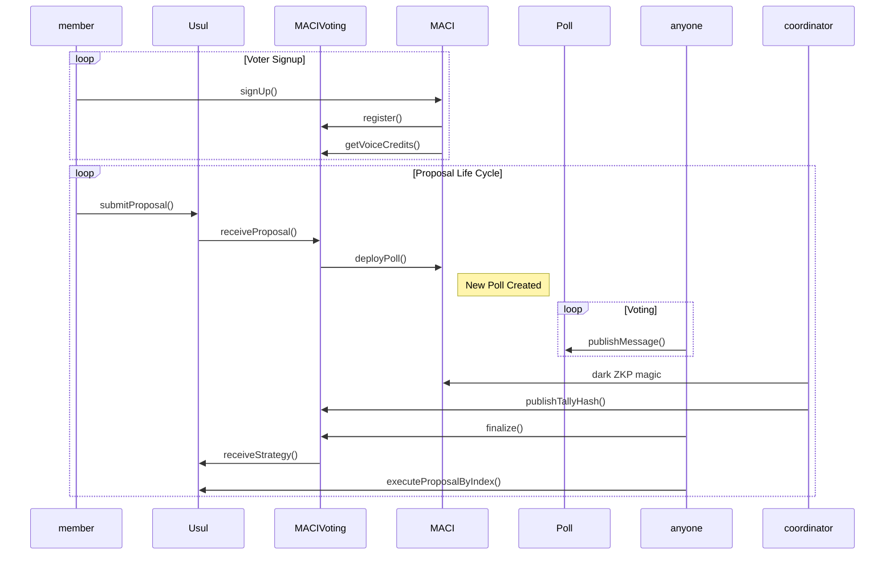

```mermaid
sequenceDiagram
    participant member
    participant Usul
    participant MACIVoting
    participant MACI
    participant Poll
    participant anyone
    participant coordinator
    
    loop Voter Signup
        member ->> MACI: signUp()
        MACI ->> MACIVoting: register()
        MACI ->> MACIVoting: getVoiceCredits()
    end

    loop Proposal Life Cycle
        member ->> Usul: submitProposal()
        Usul ->> MACIVoting: receiveProposal()

        MACIVoting ->> MACI: deployPoll()
        Note right of MACI: New Poll Created
        
        loop Voting
            anyone ->> Poll: publishMessage()
        end
        
        coordinator ->> MACI: dark ZKP magic
        coordinator ->> MACIVoting: publishTallyHash()
        
        anyone ->> MACIVoting: finalize()
        MACIVoting ->> Usul: receiveStrategy()        
        anyone ->> Usul: executeProposalByIndex()
        
    end

```